# 작심며칠

> 목표를 만들고 매일 인증하며, 목표 달성 과정을 게시글과 투표로 공유하는 커뮤니티 기반 습관 관리 서비스입니다.

## 배포 링크

[서비스 바로가기](https://oz-union-16-fe-team2.vercel.app/)

## 프로젝트 개요

작심며칠은 사용자가 개인 목표를 설정하고 일별 체크 기록을 남길 수 있는 서비스입니다. 사용자는 목표와 연결된 게시글을 작성하고, 댓글/좋아요/스크랩/투표 기능을 통해 다른 사용자와 목표 달성 경험을 공유할 수 있습니다.

## 주요 기능

### 인증

#### 일반 회원가입 / 내정보 변경

- 닉네임 중복 확인
- 이메일 인증
- 프로필 이미지 선택
- 내정보 변경

|                                    회원가입                                    |                                       내정보 변경                                       |
| :----------------------------------------------------------------------------: | :-------------------------------------------------------------------------------------: |
| 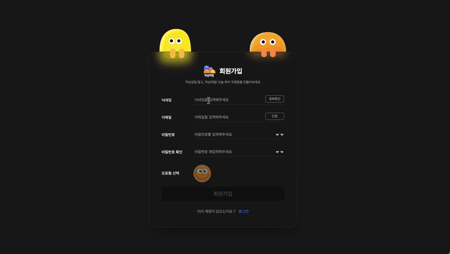 | 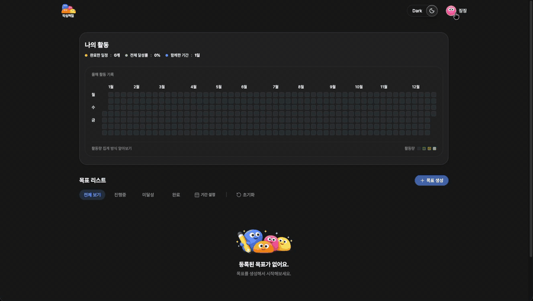 |

#### 로그인

- 일반 로그인
- 소셜 로그인 (Google, Kakao, Naver 지원)
- 이메일 통합 계정 기반, 회원가입 시 설정한 닉네임 및 프로필 사용
- 인증 상태 기반 페이지 접근

|                                   일반 로그인                                    |                                       소셜 로그인                                       |
| :------------------------------------------------------------------------------: | :-------------------------------------------------------------------------------------: |
| 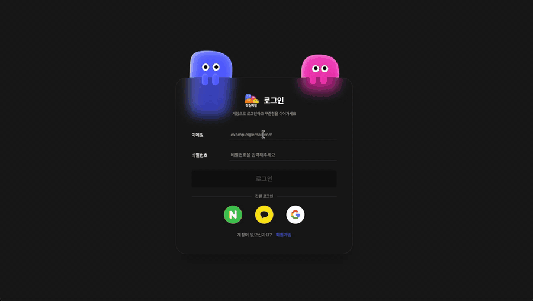 | 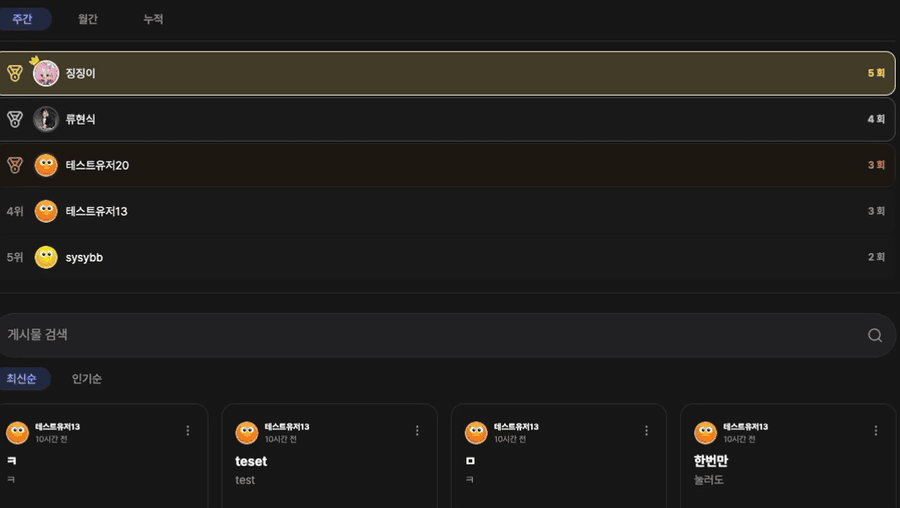 |

### 메인 / 랭킹

- 게시글 목록 조회
- 최신순, 인기순(댓글 수 + 게시글 좋아요 수 기반), 추천순(회원 전용, 태그 + 좋아요 기반) 정렬
- 게시글 검색
- 8개씩 페이지네이션
- 주간, 월간, 누적 목표별 랭킹 조회
- 회원/비회원 접근 분기

|                                         비회원 메인                                          |                                              회원 메인                                              |
| :------------------------------------------------------------------------------------------: | :-------------------------------------------------------------------------------------------------: |
| 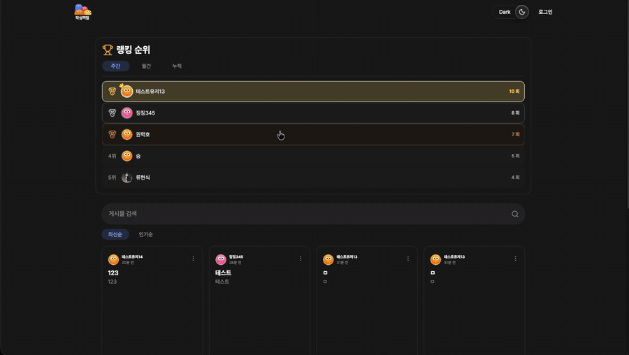 | 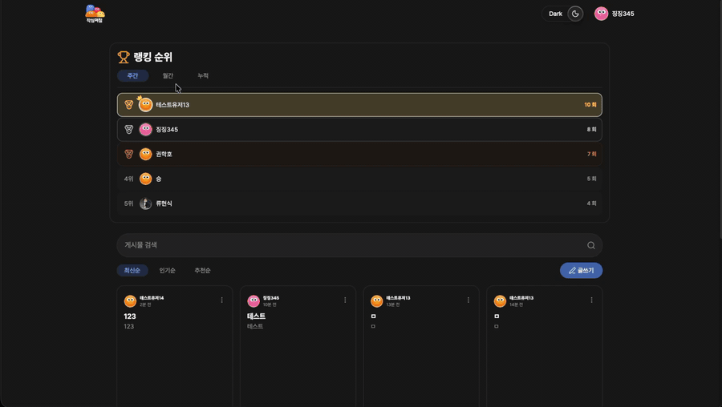 |

### 게시글 작성 / 상세 / 수정

#### 게시글 작성

- 게시글 작성
- 이미지 최대 3장 첨부 (파일첨부 및 드래그 가능)
- 태그 최대 3개 선택
- 진행 중인 목표 연결
- 투표 생성

#### 게시글 상세

- 이미지 확대 보기
- 좋아요, 공유하기, 북마크
- 댓글 수정, 삭제, 신고

#### 게시글 수정

- 제목, 내용 수정
- 태그 수정
- 연결된 목표 수정
- 투표 수정 불가

|                                      게시글 작성                                       |                                      게시글 상세                                       |                                     게시글 수정                                      |
| :------------------------------------------------------------------------------------: | :------------------------------------------------------------------------------------: | :----------------------------------------------------------------------------------: |
| 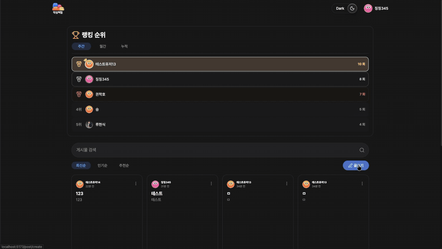 | 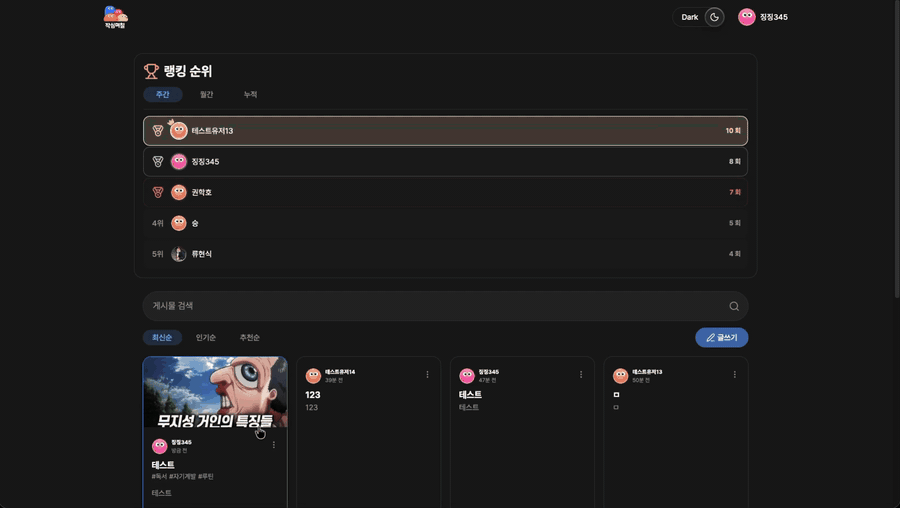 | 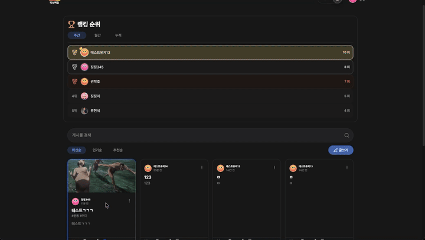 |

### 목표 관리 / 나의 활동

- 목표 생성, 체크, 삭제
- 목표 진행률 반영
- 목표 상태 및 기간 필터
- 활동 요약 및 히트맵 조회

|                                   목표 관리                                   |                                    나의 활동 / 히트맵                                     |
| :---------------------------------------------------------------------------: | :---------------------------------------------------------------------------------------: |
| 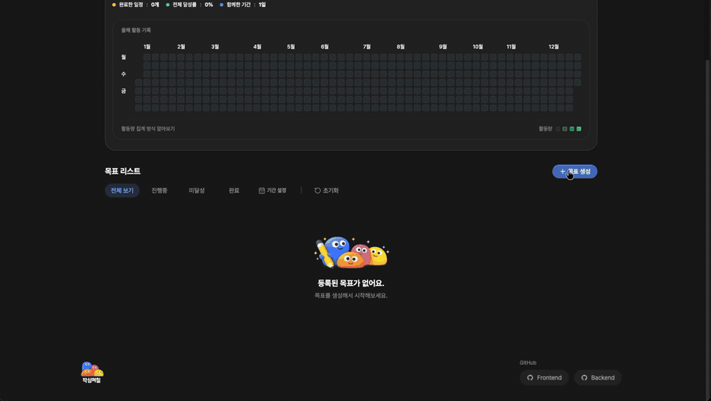 | 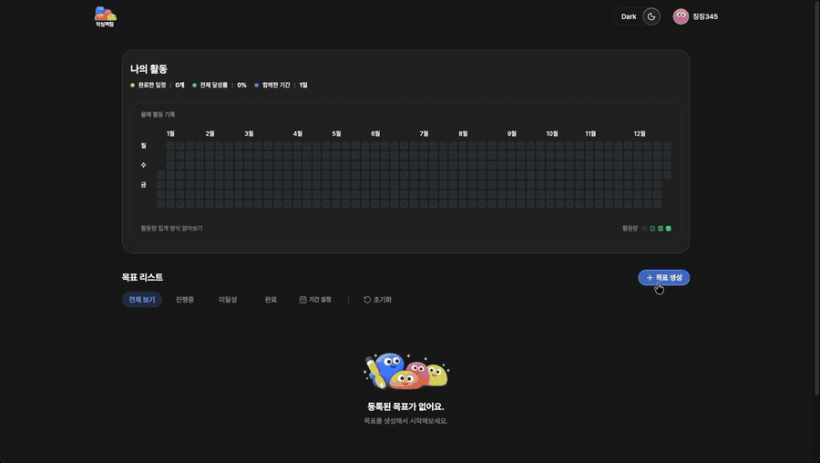 |

### 내가 쓴 게시글 / 북마크

- 내가 작성한 게시글 목록 조회
- 북마크한 게시글 목록 조회
- 게시글 검색
- 8개씩 페이지네이션
- 게시글 수정 및 삭제

|                                     내가 쓴 게시글                                     |                                        북마크                                         |
| :------------------------------------------------------------------------------------: | :-----------------------------------------------------------------------------------: |
| 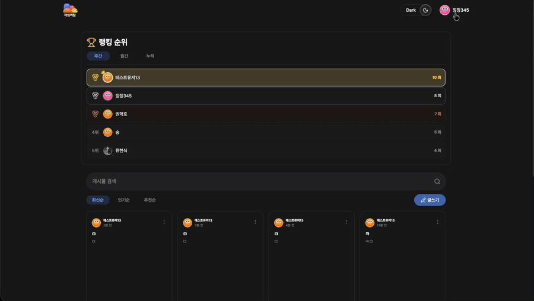 | 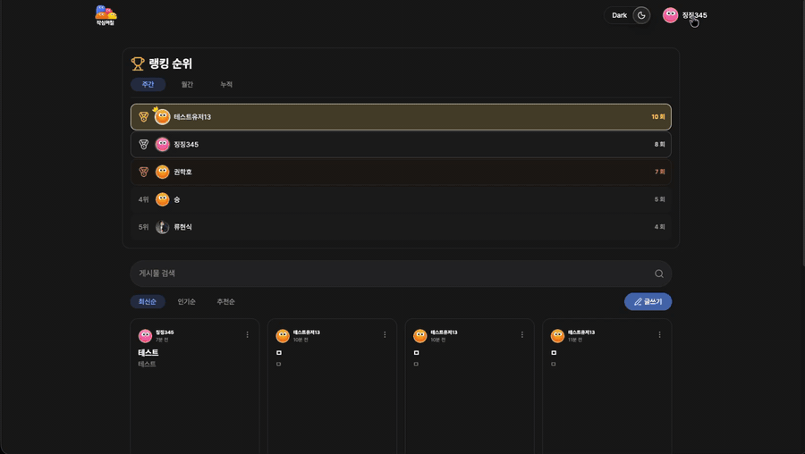 |

## 기술 아키텍처

<p align="center">
  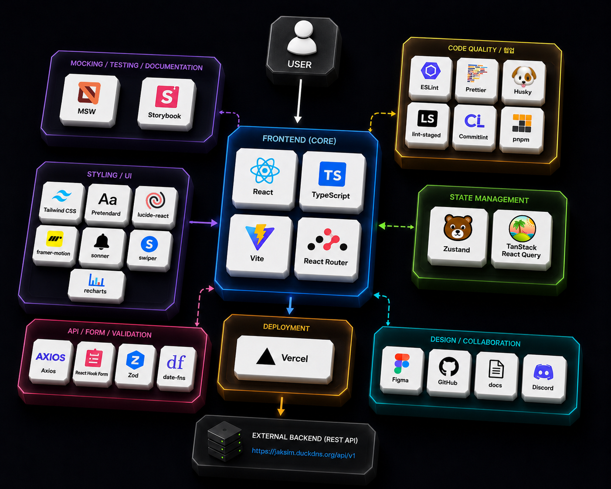
</p>

### Frontend

<div>
  
  
  
  
</div>

### Styling / UI

<div>
  
  
  
  
  
  
  
  
  
  
</div>

### State / Data Fetching

<div>
  
  
  
</div>

### Form / Validation

<div>
  
  
  
</div>

### Mocking / Test / Docs

<div>
  
  
  
  

</div>

### Code Quality / Collaboration / Deploy

<div>
  
  
  
  
  
  
  
  
</div>

## Getting Started

```yaml
- packageManager: pnpm
- react: 19
- storybook: 10.3
```

### 환경 변수 설정

프로젝트 루트 디렉토리에 `.env` 파일을 생성하고 아래 값을 추가합니다.

```env
VITE_API_BASE_URL=your_api_base_url_here
```

### 개발 서버 실행

```bash
pnpm install
pnpm dev
```

### Storybook 실행

```bash
pnpm storybook
```

## 팀

### FE

| <a href="https://github.com/alstmd9902"><br /><sub><b>@alstmd9902</b></sub></a> | <a href="https://github.com/0rrriiinnn0"><br /><sub><b>@0rrriiinnn0</b></sub></a> | <a href="https://github.com/hyunsik2000"><br /><sub><b>@hyunsik2000</b></sub></a> |
| :-----------------------------------------------------------------------------------------------------------------------------------------------------------------------: | :--------------------------------------------------------------------------------------------------------------------------------------------------------------------------: | :--------------------------------------------------------------------------------------------------------------------------------------------------------------------------: |
|                                                                                  오승연                                                                                   |                                                                                    김예린                                                                                    |                                                                                    류현식                                                                                    |
|                                                                                팀장 (Lead)                                                                                |                                                                                     팀원                                                                                     |                                                                                     팀원                                                                                     |
|                                                              로그인/회원가입<br />마이페이지<br />목표 관리                                                               |                                                                       게시글 상세<br />댓글<br />투표                                                                        |                                                                 게시글 목록<br />게시글 작성/수정<br />랭킹                                                                  |

## 프로젝트 규칙

> 자세한 내용은 각 문서를 참고해주세요.

| 문서                                            | 설명            |
| ----------------------------------------------- | --------------- |
| [BRANCH.md](./docs/BRANCH.md)                   | 브랜치 전략     |
| [COMMIT.md](./docs/COMMIT.md)                   | 커밋 컨벤션     |
| [CONVENTION.md](./docs/CONVENTION.md)           | 코드 컨벤션     |
| [STRUCTURE.md](./docs/STRUCTURE.md)             | 프로젝트 구조   |
| [TROUBLESHOOTING.md](./docs/TROUBLESHOOTING.md) | 트러블슈팅 기록 |
| [README.md](./docs/README.md)                   | 문서 가이드     |

## Documents

> [요구사항 정의서](https://docs.google.com/spreadsheets/d/19-_7dQ0Yf0QlA2py3M-Yo2n5HnJo3LIc76RSVy_i6qs/edit?gid=0#gid=0)
>
> [API 명세서](https://docs.google.com/spreadsheets/d/1O9q_wttaKF0zb0zollz5SgBZb2u1RdoPsE6xy1lOjBE/edit?gid=669362257#gid=669362257)
>
> [플로우차트](https://www.figma.com/board/FJg467HTAnQSMuLGKaD2lO/Untitled?node-id=0-1&t=BNNaFhAxIFyNlJVy-1)
>
> [화면정의서](https://www.figma.com/design/p5g6QAL8NXyHirhOqxI5MR/Untitled?node-id=53-2&t=KvXxENWaiYRZJHOl-1)
